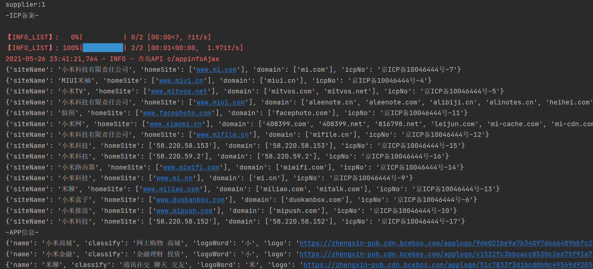
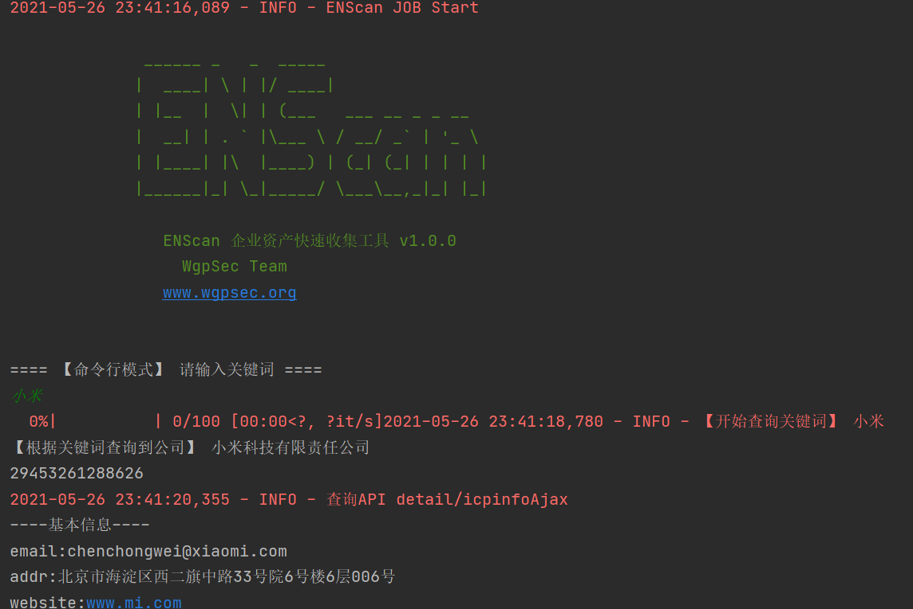
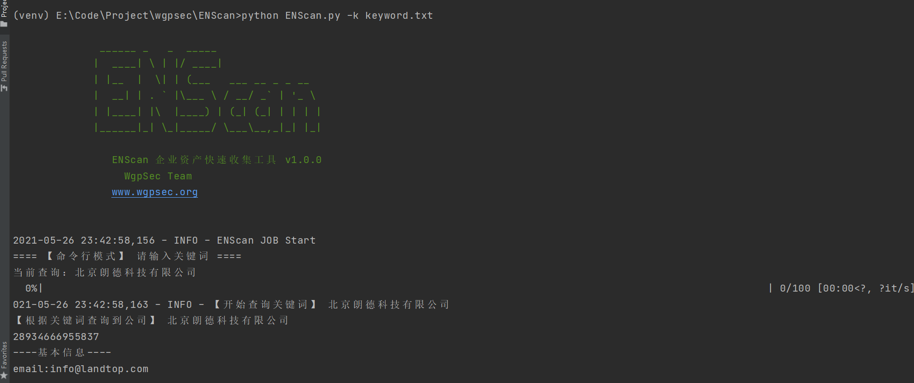
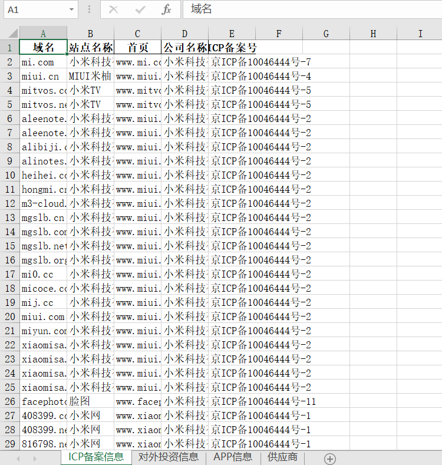

<h1 align="center">ENScan 🛠</h1>

## 背景

本项目为 [狼组信息化平台](https://plat.wgpsec.org) 功能项目，该项目开源

程序主要对[百度爱企查](aiqicha.baidu.com) API和接口进行封装可获取

- 企业基本信息（法人、电话、公司地址等等）
  - 企业ICP备案号以及网站
  - 企业APP信息
  - 企业微信公众号信息
  - 企业微博信息
  - 子公司的基本信息
  - 供应商信息
  - .....
- 该企业投资大于51%的企业基本信息（可设定）
-  自动导出

有更多需求可以联系@Keac 师傅提

## 快速使用

BiBi：https://www.bilibili.com/video/BV1Nv411H7CN/

1. 安装依赖 (部分依赖有点问题，需要手动安装下)

   `pip install -r requirements.txt`

2. 命令使用

   `python ENScan.py`

   输入关键词即可查询
   
3. 批量查询

   `python ENScan.py -k keyword.txt` keyword.txt 为你自己制定的企业关键词，每行一个

若使用出现 “【风险校验】需要更新Cookie” 信息需要使用浏览器打开https://aiqicha.baidu.com/ 滑动验证码校验后复制所有COOKIE信息替换脚本中的 self.cookie

`self.invest_is_rd = False`  是否选出不清楚投资比例的，比如未公示投资多少的，开启会增加发现几率，但可能会不对应

**请求错误会自动尝试重连20次** ，若替换Cookie无果可以尝试开启代理，速度会偏慢

## API部署

本项目需要运行在Linux/MAC环境下，不支持Windows，使用了任务队列RQ

需要安装配置Redis

`python api.py` (启动 web API)

`python scan_worker.py` (启动扫描端)

